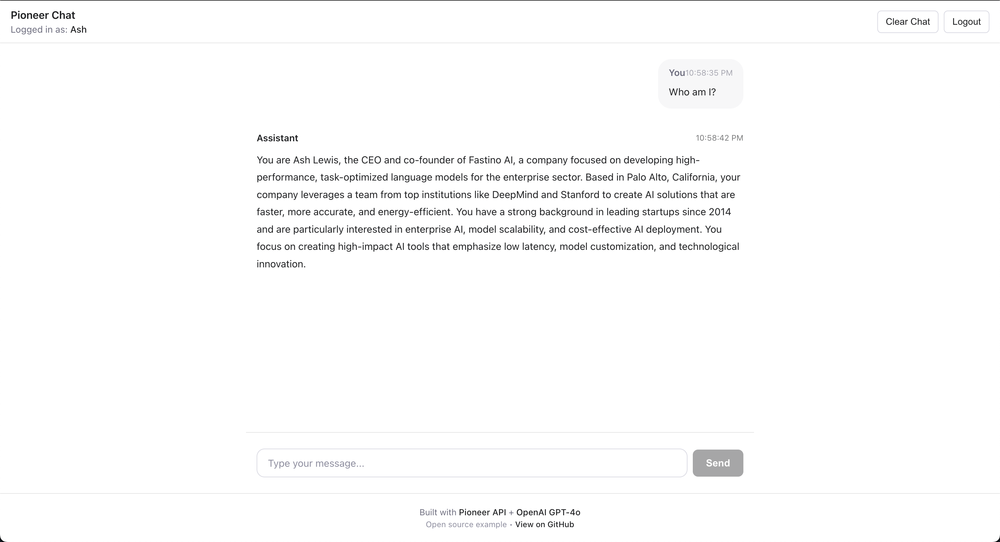

# Pioneer + OpenAI Chat Example

A simple, open-source example demonstrating how to build a personalized AI chat application using [Fastino's Pioneer Personalization API](https://api.fastino.ai) with OpenAI's GPT-4o.



## What This Does

This project showcases how to:

- **Build a personalized AI assistant** that learns from conversations
- **Integrate Pioneer's personalization API** to provide context-aware responses
- **Use GPT-4o** for natural language understanding and generation
- **Create a clean, modern UI** for chat interactions
- **Automatically ingest conversations** for continuous learning

## ✨ Features

- 🧠 **Contextual Memory** - Remembers user preferences and past conversations
- 🎯 **Personalized Responses** - Adapts to user communication style
- 📚 **Relevant Context Retrieval** - Shows what context was used for each response
- 👤 **User Profile Summaries** - Displays learned information about the user
- 🔒 **Privacy-First** - All data automatically anonymized via GLiNER-2
- 💬 **Beautiful UI** - Modern, responsive chat interface

## 🏗️ Architecture

```
┌─────────────┐
│   React UI  │
└──────┬──────┘
       │
       ├─────────────────┐
       │                 │
┌──────▼──────┐   ┌─────▼─────┐
│   FastAPI   │   │  Pioneer  │
│   Backend   │──▶│    API    │
└──────┬──────┘   └───────────┘
       │
┌──────▼──────┐
│   OpenAI    │
│   GPT-4o    │
└─────────────┘
```

## 📋 Prerequisites

Before you begin, you'll need:

1. **Python 3.9+** installed
2. **Node.js 18+** and npm installed
3. **Pioneer API Key** - Get one at [https://api.fastino.ai](https://api.fastino.ai)
4. **OpenAI API Key** - Get one at [https://platform.openai.com/api-keys](https://platform.openai.com/api-keys)

## 🚀 Quick Start

### 1. Clone the Repository

```bash
git clone <your-repo-url>
cd pioneer-example
```

### 2. Set Up Environment Variables

Copy the example environment file and add your API keys:

```bash
cp env.example .env
```

Edit `.env` and add your API keys:

```bash
# Required
PIONEER_API_KEY=pio_sk_your_api_key_here
OPENAI_API_KEY=sk-your_openai_key_here

# Optional
BACKEND_PORT=8000
```

### 3. Run with Helper Script (Easiest)

**On macOS/Linux:**
```bash
chmod +x run.sh
./run.sh
```

**On Windows:**
```bash
run.bat
```

The script will:
- Create a virtual environment
- Install all dependencies
- Start both backend and frontend
- Open the app at `http://localhost:3000`

### 4. Or Run Manually

**Install Backend Dependencies:**
```bash
python -m venv venv
source venv/bin/activate  # On Windows: venv\Scripts\activate
pip install -r requirements.txt
```

**Install Frontend Dependencies:**
```bash
cd frontend
npm install
cd ..
```

**Start Backend (Terminal 1):**
```bash
source venv/bin/activate
python backend/main.py
```

**Start Frontend (Terminal 2):**
```bash
cd frontend
npm run dev
```

### 5. Open Your Browser

Navigate to `http://localhost:3000`

You'll see a registration screen. Enter your email (use the same email as your Pioneer account) and click "Start Chatting"!

## 📚 How It Works

### 1. **User Registration**
When you first open the app, you'll see a registration screen where you enter your email. This calls Pioneer's `/register` endpoint:
```python
POST /register
{
  "email": "user@example.com",
  "purpose": "A personalized AI chat assistant..."
}
```

### 2. **Profile Summary**
Pioneer generates a profile summary from available data:
```python
GET /summary?user_id=user@example.com
```
This summary is added to the system prompt for personalization.

### 3. **Context Retrieval**
For each message, relevant context is retrieved:
```python
POST /chunks
{
  "user_id": "user@example.com",
  "history": [...conversation...],
  "k": 5
}
```

### 4. **Enhanced Prompting**
The user's message is enhanced with:
- User profile summary (in system prompt)
- Relevant context chunks (appended to message)

### 5. **GPT-4o Response**
OpenAI generates a response with full context awareness.

### 6. **Conversation Ingestion**
The conversation is automatically ingested back to Pioneer:
```python
POST /ingest
{
  "user_id": "user@example.com",
  "message_history": [...]
}
```

This creates a continuous learning loop!

## 🛠️ API Endpoints

### Backend API

- **POST /chat** - Send a message and get a personalized response
  ```json
  {
    "message": "What should I eat for dinner?",
    "conversation_history": [],
    "user_email": "user@example.com"
  }
  ```

- **POST /register** - Register a new user
  ```json
  {
    "email": "user@example.com",
    "name": "John Doe",
    "timezone": "America/Los_Angeles"
  }
  ```

- **GET /health** - Health check

## 🎨 Customization

### Changing the AI Model

Edit `backend/main.py` and change the model parameter:

```python
completion = openai_client.chat.completions.create(
    model="gpt-4o",  # Change to "gpt-3.5-turbo", "gpt-4-turbo", etc.
    messages=messages,
    temperature=0.7,
    max_tokens=1000
)
```

### Adjusting Context Retrieval

Modify the chunk retrieval parameters in `backend/main.py`:

```python
chunks = await get_relevant_chunks(
    user_email, 
    conversation, 
    k=5,  # Number of chunks (increase for more context)
)
```

And update the similarity threshold:

```python
json={
    "user_id": user_email,
    "history": history,
    "k": k,
    "similarity_threshold": 0.25  # Lower = more permissive (0.15-0.50)
}
```

### Customizing the UI

The frontend is built with React and uses CSS for styling. Edit:
- `frontend/src/App.jsx` - Main component logic
- `frontend/src/App.css` - Styling

## 📖 Learn More

### Pioneer API Documentation
- [Quick Start Guide](https://api.fastino.ai/docs/quick-start)
- [API Reference](https://api.fastino.ai/docs/api-reference)
- [Integration Patterns](https://api.fastino.ai/docs/integration-patterns)

### Key Concepts

**User World Model**: Pioneer builds a comprehensive understanding of each user through multi-stage processing:
- Stage 1: Social profile scraping
- Stage 2: Profile summarization
- Stage 3: Agentic search over data

**Memory Types**:
- `memory` - Extracted facts from conversations and documents
- `stage3` - Q&A pairs from agentic search
- Both are searchable via the `/chunks` endpoint

**Personalization Patterns**:
1. **System Prompt Enhancement** - Add user summary to every session
2. **Contextual Grounding** - Retrieve relevant chunks at every turn
3. **Tool-Augmented Agent** - Use `/query` for complex questions
4. **Continuous Learning** - Ingest conversations for improvement

## 🔒 Privacy & Security

- All API keys should be stored in `.env` (never commit to git)
- Pioneer automatically anonymizes PII using GLiNER-2
- User data is isolated by `user_id`
- Frontend runs on your local machine

## 🐛 Troubleshooting

### Backend won't start
- Check that Python 3.9+ is installed: `python --version`
- Ensure all dependencies are installed: `pip install -r requirements.txt`
- Verify your API keys in `.env`

### Frontend won't start
- Check that Node.js 18+ is installed: `node --version`
- Ensure dependencies are installed: `cd frontend && npm install`
- Try deleting `node_modules` and reinstalling: `rm -rf node_modules && npm install`

### API Errors
- **401 Unauthorized**: Check your API keys in `.env`
- **Rate Limit**: Pioneer API may have rate limits (check docs)
- **Network Error**: Ensure backend is running on port 8000

### No Personalization
- Personalization improves over time as more data is ingested
- Try having a few conversations about your preferences
- Check the context chunks being retrieved (click the expand icon)

See [SETUP.md](SETUP.md) for detailed troubleshooting steps.

## 🤝 Contributing

This is an open-source example project. Feel free to:
- Fork and modify for your use case
- Submit issues for bugs or improvements
- Share your own implementations

See [CONTRIBUTING.md](CONTRIBUTING.md) for details.

## 📄 License

MIT License - see [LICENSE](LICENSE) file for details

## 🙏 Acknowledgments

- [Fastino Pioneer API](https://api.fastino.ai) - Personalization infrastructure
- [OpenAI](https://openai.com) - GPT-4o language model
- Built with FastAPI and React

---

**Questions?** Check out the [Pioneer Documentation](https://api.fastino.ai) or open an issue!
